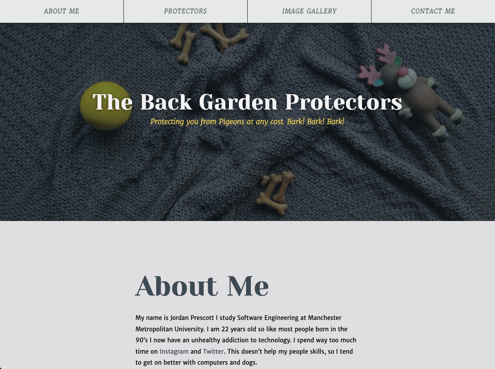
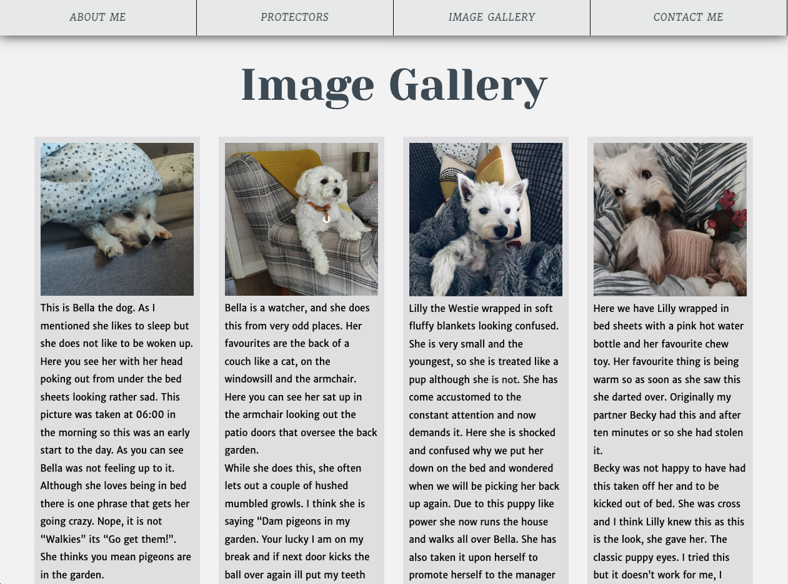

# Web Development Assingment - Y1

The objective of the assignment was to create a one-page website dedicated to a personal topic. In this case, the chosen topic was my two dogs, Bella and Lilly. The website aimed to showcase their unique personalities providing an engaging and informative experience for visitors.

The one-page website featured a visually appealing design that adapted seamlessly to different screen sizes, following a mobile-first approach. It included an introduction section to set the context and captivate visitors from the start. A section dedicated to Bella and Lilly provided details about their breeds, ages, and interesting facts, along with heartwarming stories and personal anecdotes. A photo gallery showcased high-quality images capturing their adorable antics, and a section highlighted their distinctive personality traits and quirks. Information about their daily routines and favorite activities was shared, inviting visitors to get a glimpse into their lives. The website also offered contact information and social media sharing buttons for further engagement and easy sharing of Bella and Lilly's charm.

Overall, the website celebrated the joy that Bella and Lilly bring into my life and aimed to create a connection with visitors by sharing their stories and capturing their adorable moments.

## Screenshots
### Initial Screen

### Image Gallery

### Contact Form

